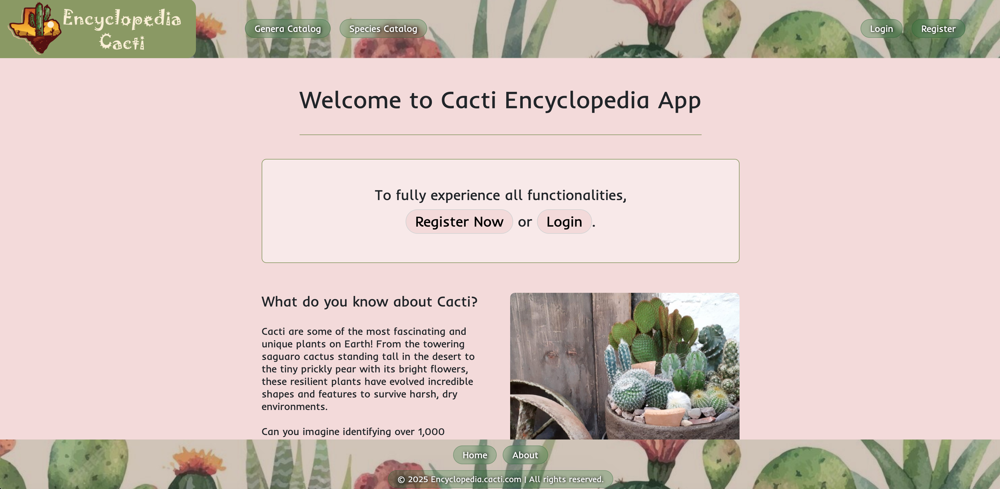
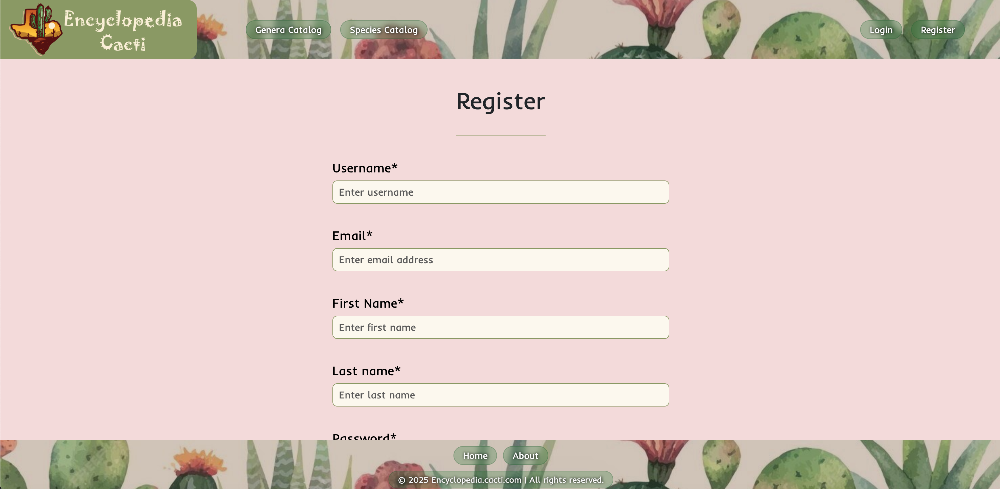

# 🌵 Cacti Encyclopedia

A platform for cactus enthusiasts to explore, contribute, and manage species information. Users can browse an extensive catalog of cacti species, add new species, contribute facts, and interact with a curated database of cacti.

## 📜 Contents

- [Introduction](#-introduction)
- [Application Features](#-application-features)
- [User Roles](#-user-roles)
- [Running the Application](#--running-the-application)
- [Running with Docker](#running-cacti-encyclopedia-with-docker)

## 🌟 Introduction

Cacti Encyclopedia is a web application designed for cactus enthusiasts to share knowledge about different species of cacti. Users can register, contribute species, add facts, and interact with a curated database of cacti. The platform ensures proper categorization of species and allows administrative control over approvals and fact submissions.

## 🚀 Application Features

### 📌 Home Page
Provides useful information about cacti.



### 🔑 Registration & Login
- Users can register an account.
- Upon successful registration, users are redirected to login.




### ℹ️ About Page
- Brief information about the platform and its purpose.


### 📖 Catalog Page
- Displays all **genera** with added species.
- Sidebar shows:
    - **Curious facts**
    - **10 recently added and approved species**
- Clicking a genus leads to the **Species Page**.


### 🌱 Species Pages
- Lists all approved species under the selected genus.
- Clicking a species leads to **Species Details Page**.


### 📋 Species Catalog Page
- Displays all approved species alphabetically, regardless of genus.
- Clicking a species leads to **Species Details Page**.


### 🔍 Species Details Page
- Displays species photos and details.
- Logged-in users can post questions about the species.


### ✍️ Add Fact *(Admin Only)*
- Admins can add **interesting facts** that appear on the Catalog Page.
- Facts are stored in the **facts-svc microservice** via **Kafka**.

### ➕ Add Genera *(Admin Only)*
- Adds new genera to categorize species.

### 🌵 Add Species *(Logged-in Users, including Admins)*
- Users can add new species.
- Regular users are redirected to a **Thank You** page upon submission.
- Admins are redirected back to **Add Species** for quick content feeding.


### 👥 User Administration *(Admin Only)*
- The **first registered user is an Admin**.
- Admins can **assign or remove admin roles** from users.


### ✅ Species Administration *(Admin Only)*
- Admins approve or delete newly added species.
- **Unapproved species are deleted after 30 days**.


### 👤 My Profile *(Logged-in Users, including Admins)*
- Displays user information and their added species with approval status.

## 🔐 User Roles

| Role  | Permissions |
|--------|------------|
| **Admin**  | Can perform all user actions plus manage users, approve/delete species, add genera, and add facts |
| **User**   | Can add species, post species questions |

# 🛠️ Running the Application

## **1. Setting Up Kafka**
Start **apache/kafka:3.9.0** as a Docker container. Ensure it's running properly before starting the application.

## **2. Configure Kafka in the Application**
Edit **`application-dev.properties`** and set:
```properties
spring.kafka.bootstrap-servers=<your_kafka_address>
```

## **3. Configure Database Credentials**
Choose one of the following methods:
- **Option A:** Edit `application-dev.properties`:
  ```properties
  spring.datasource.username=<your_user>
  spring.datasource.password=<your_password>
  ```
- **Option B:** Use environment variables:
  ```bash
  export MYSQL_USER=<your_user>
  export MYSQL_PASS=<your_password>
  ```

## **4. Set Active Profile to `dev`**
Ensure the application is running with the **`dev`** profile.

## **5. Initial Start Without `data.sql` Import**
Run the application **without importing** `data.sql` so the database can initialize.

## **6. Import `data.sql` After First Start**
After the first successful start:
1. **Enable SQL import** by adding this to `application.properties`:
   ```properties
   spring.sql.init.mode=always
   ```
2. Restart the application to execute the import.
3. After import, **disable SQL import** by changing `always` to `never`:
   ```properties
   spring.sql.init.mode=never
   ```

## **7. User Roles**
- The **first registered user** gets **ADMIN** role.
- Every following user gets the **USER** role.

## **8. Configure Facts Service**
Set up the **Facts Service URL** in `application.properties`:
```properties
facts-svc.base-url=<your_facts_service_url>
```

---

# Running Cacti Encyclopedia with Docker

## **1. Clone the Required Repositories**
```bash
git clone https://github.com/Tuttee/CactiEncyclopedia.git
git clone https://github.com/Tuttee/facts-svc.git
```
Ensure both repos are in adjacent directories.

## **2. Build the Applications**
Inside each repo, run:
```bash
mvn clean install
```

## **3. Start with Docker**
From the **Cacti Encyclopedia** repo, run:
```bash
docker compose up -d
```
> **Note:** The `facts-svc` **build** property in `docker-compose.yml` may need directory adjustments.

---

## 🎉 **Cacti Encyclopedia is Now Running!**
You can access it and start using the service. Let me know if you need any help! 🚀
